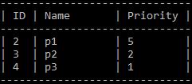

# Table Printer

`Table Printer` is a class used to present data in a table.

- **Usage example:**
    ``` cpp
    // Setting layout
	TablePrinter table_printer;
	table_printer.AddColumn("ID", 2);
	table_printer.AddColumn("Name", 10);
	table_printer.AddColumn("File", 10);
	table_printer.AddColumn("Priority", 2);

    // Printing table
	table_printer.PrintHeader();
	for (auto process : processes_) {
        // Adding data
        table_printer << process->id() << process->name() << process->file_name() << process->priority();
    }
	table_printer.PrintFooter();
    ```

    


## TablePrinter()

- **Arguments:**
  - `{std::string} column_separator = "|"`
  - `{int} column_padding = 1`

- **Usage:**
  Creates a new instance of `TablePrinter` with default values of `column_padding` and `column_separator`.

  ``` cpp
  TablePrinter table_printer;
  ```

  ``` cpp
  TablePrinter table_printer("][", 2);
  ```

## AddColumn()
- **Arguments:**
  - `{std::string} column_name`
  - `{unsigned int} column_width`
  - `{bool} column_align_left = true`

- **Usage:**
  Adds a new column to the table layout with given parameters. `column_align_left` is set to `true` by default.

  ``` cpp
  table_printer.AddColumn("name", 10);
  ```

  ``` cpp
  table_printer.AddColumn("id", 2, false);
  ```

## ClearColumns()

- **Usage:**
  Clears table layout by removing all columns.

  ``` cpp
  table_printer.ClearColumns();
  ```

## PrintHeader()

- **Usage:**
  Prints columns names between two horizontal lines

  ``` cpp
  table_printer.PrintHeader();
  ```

## PrintFooter()

- **Usage:**
  Prints single horizontal line

  ``` cpp
  table_printer.PrintFooter();
  ```

## operator<<

- **Usage:**
  Used to input table data.

  ``` cpp
  table_printer << id << "hello" << 5;
  ```